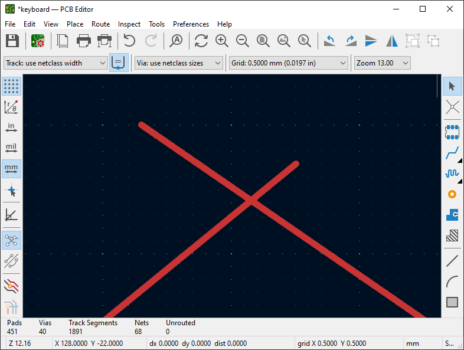
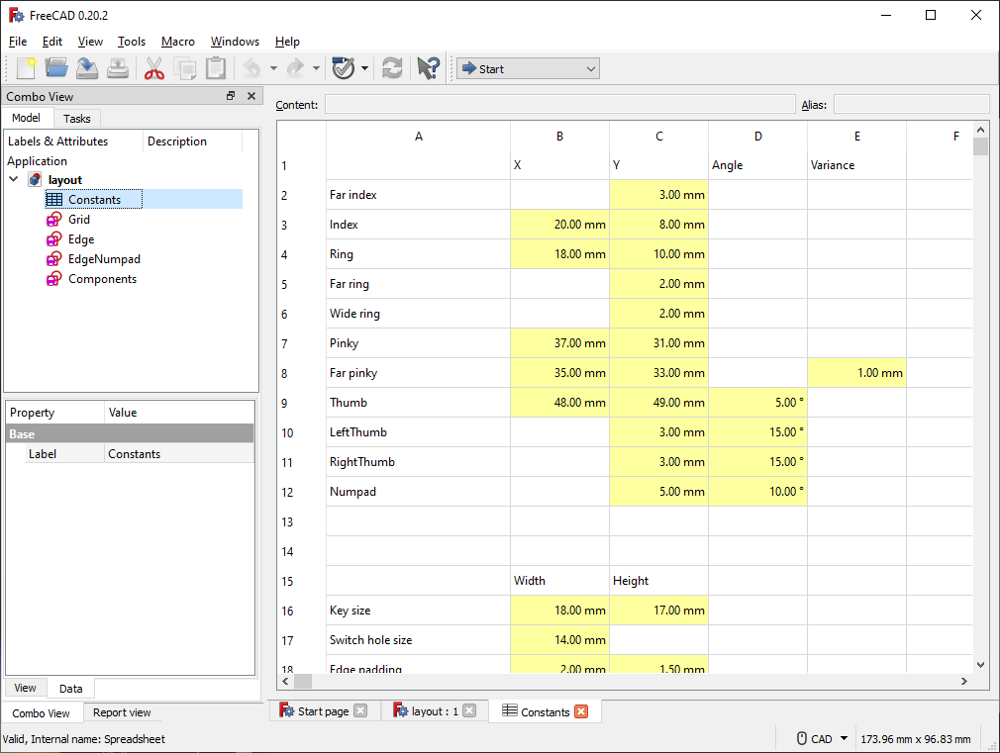
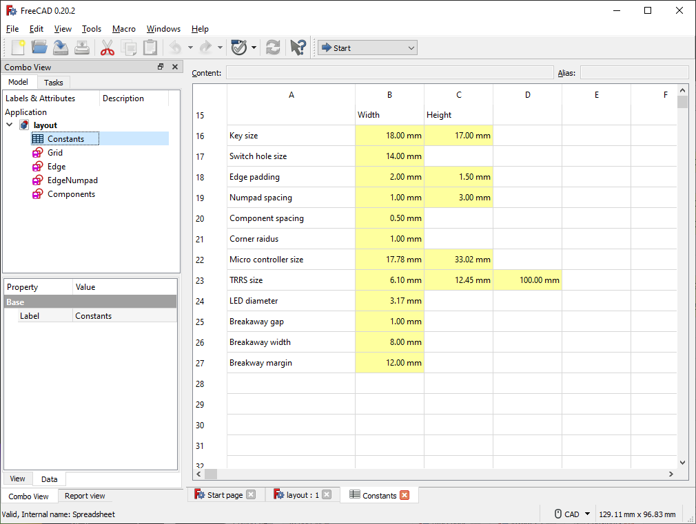

# articulation70

The _articulation70_ keyboard is a successor to the [articulation80](https://github.com/mylestunglee/articulation80), with a better layout and LEDs.


It features:
- Reversible PCB to reduce manufacturing costs for hobby usage.
- Variable pinky stagger, supporting ±1 mm vertically offsetted soldering configurations.
- 3 × 6 main body, 3 thumb switches, 2 corner switches and 3 × 4 numpad layout.
- Kailh Choc V1 hot-swap support.
- A breakaway-able number pad.
- Serial or I2C connection between halves.
- Pro Micro-compatible controller support, however a micro-controller. with more pins are required to operate LEDs 2 and 3.
- 3 LEDs

## KiCad plugins

This repo comes included with two plugins. To install these plugins, copy the directories in `plugins` into your _Plugins Directory_, which is found by _Tools → External Plugins → Open Plugins Directory_ in the PCB Editor.

### Split intersecting traces

When joining traces from rotated switches, it can be difficult to connect traces from two angles to form a aesthetic curve. This plugins splits two selected intersecting traces into four traces.

An example of use:



### Total trace length

Why not?


## Build Instructions

This build is very similar to many hobby keyboards. Please refer to the instructions for  [articulation80](https://github.com/mylestunglee/articulation80). You will need a soldering iron.

#### Which jumpers do I need to solder?

If using serial, then solder J1, and J4. If using I2C, then solder J2, J3 and J4. Solder on the back of each respective half.

### Build Parts

I would recommend substituting for cheaper or easier to source components when possible.

| Component | Quantity | MPN | Purchase Link | Remarks |
|:-|:-|:-|:-|:-|
| PCB | 2 |
| Left plate | 1
| Right plate | 1
| Micro-controller | 2 | Elite-C | [Link](https://mechboards.co.uk/products/elite-c-v4)
| Through-hole TRRS jack | 2 | PJ-320A | [Link](https://mechboards.co.uk/products/trrs-jacks?variant=40330077241549)
| TRRS cable | 1 | | [Link](https://mou.sr/3QC5ykN) | Also called a 4-pin 3.5mm audio auxiliary cable |
| Reset button | 2 | PTS526 SM15 SMTR2 LFS | [Link](https://mou.sr/3tXtsOQ) | Different button operating force are possible
| LED | 3 | HLMP-1401 | [Link](https://mou.sr/45Zy9Vw) | Any T1 size
| 150Ω Resistor  | 3 | RC1206FR-07150RL | [Link](https://mou.sr/3QEyQzo) | Optional, for LEDs
| 4.7kΩ Resistor  | 2 | RC1206FR-104K7L | [Link](https://mou.sr/46XoOPE) | Optional, for I2C connection
| SMD Diode | 70*    | 1N4148W-TP | [Link](https://mou.sr/3D01KSP) | Any SOD-123 size |
| Hot swap micro-controller sockets | 5 | 315-43-112-41-003000 | [Link](https://mou.sr/3QfEIO2) | Recommended
| Hot swap pins | 52 | 3320-0-00-15-00-00-03-0 | [Link](https://mou.sr/3tYd80f) | Recommended |
| Rubber feet | 12** | SJ-5302 CLEAR | [Link](https://mou.sr/3QFq1oL)
| Hot swap key sockets | 70*      | CPG135001S30 | [Link](https://mechboards.co.uk/products/kailh-choc-hotswap-sockets)
| Key Switch | 70* | CPG135001 | [Link](https://www.aliexpress.com/item/1005005446722280.html)
| Key Cap | 70* | | | Ideally different key caps for thumbs |

*Adjust for number of keys desired.

**Adjust for number of numpads.

## How to order PCBs and plates

I ordered from JLCPCB, however there are many other manufacturers. Take a look at [PCBShopper](https://pcbshopper.com/).

For the PCBs, I used:
- Base material: FR-4
- PCB thickness: 1.6 mm 
- PCB colour: black 
- Surface finish: LeadFree HASL
- Remove order number: Yes


For the plates, I used:
- Base material: FR-4
- PCB thickness: 1.2 mm 
- PCB colour: black 
- Surface finish: HASL (with lead) because the unleaded option greatly increases cost and the plates do not have any pads.
- Remove order number: Yes

## How to adjust the layout

This was tested on installation of FreeCad 0.20.2, Python 3.11.6 and KiCad 7.0.6.

1. First, open `layout.FCStd` with FreeCad and open _Constants_ under the model tree view. You should see a spreadsheet of parameters.




2. Change values as necessary. If the values change too much from their intended range, then the sketch (as shown in the next step) may become broken.
3. Click on one of the sketches in the model tree view. Verify the layout shown is correct.


4. Export the layout to a file by coping the contents of `scripts/export_geometry.py` into FreeCad's Python console. The console is accessible by _View → Panel → Python console_. If you get a permission error, change `geometry.txt` to an absolute path within the repo. You should get a number, which reports the bytes written to `geometry.txt`.


5. Update the PCB by running the following scripts:

```
python scripts/update_geometry.py pcb/keyboard.kicad_pcb geometry.txt
python scripts/update_geometry.py left_plate/plate.kicad_pcb geometry.txt
python scripts/update_geometry.py right_plate/plate.kicad_pcb geometry.txt
```

For now, I will run the first script. Update the PCB files for the plates if desired.

6. Clean-up residual graphic objects on the `Edge.Cuts` layer. The script deletes all previous edges and plots edges in the `Edge` and `EdgeNumpad` sketch, which includes construction lines that should not be included in the `Edge.Cuts` layer. The script also positions footprints according to the `Components` sketch. The script will output some text because some components' positions are not specified by the layout, such as the resistors.


7. Update traces and refill copper zones. Unfortunately this step takes the longest. Make sure to thoroughly check PCB.

The PCB is ready!


## Firmware

I used [QMK](https://qmk.fm/) program the controllers. To use the same setup as me, copy the contents of `qmk` directory into your installation of `qmk_firmware/keyboards`. Flash the left and right controllers with the respective commands:
```
qmk flash -kb articulation70 -km default -bl dfu-split-left
qmk flash -kb articulation70 -km default -bl dfu-split-right
```
These commands assume the usage of Elite-C's.

## Additional documentation

```
scripts/corner_switch_pad_geometry.py
scripts/curved_switch_pad_geometry.py
```

These switches generate the geometry for curved pads featured in the switch footprints. The curved shape comes from the rectangular pad subtracted by the clearance of the centre switch drill hole. KiCad supports polygons in pads, but it is not very easy to use. These scripts makes the design of these footprints a bit easier.

## More images


## Future Considerations

There are a few improvements that can be made:

- Adding a pattern to improve visuals on the plates.
- Adding solder mask expansion on pads and pins.
- Re-route `ROW4` trace.
- Support LED placement in top-right.
- Strive to continually improve layout.

## Credit

Thanks to:
- [KBD.news](https://kbd.news/) for inspiration.
- `sevmyer` for the [open-source KiCad teardrop plugin](https://github.com/sevmeyer/kicad-arc-teardrops) which was very helpful given many KiCad plugins were for Kicad 6 and not easily update-able.
- The QMK community on Discord for their helpful explanations.
- Various open source keyboards for guidance, but not limited to: [KLOTZ](https://github.com/GEIGEIGEIST/KLOTZ), [Corne](https://github.com/foostan/crkbd) and [Breeze](https://www.afternoonlabs.com/breeze/).
